# Abstract

OnlineBank is a full-stack web-based digital banking portal designed to simulate core retail banking operations in a secure, browser-based environment. The system is built using FastAPI (Python) as the backend REST API server, React 18 as the frontend single-page application, and SQLite as the embedded relational database engine. The frontend is scaffolded with Vite 5 and styled using TailwindCSS 3.

The system provides two distinct user roles: a standard bank customer and a system administrator. A regular user can register a new account, log in, view their account balance and account details, deposit funds, withdraw funds subject to an insufficient-balance check, transfer funds to other registered users, view paginated transaction history with search and type filters, download a mini-statement of the last ten transactions, receive real-time notifications for every financial event, and update their profile and password. The administrator can view a system-wide analytics dashboard (total users, active users, cumulative deposits, withdrawals, transfers, total balance), manage all user accounts (add, update, activate/deactivate, delete), and inspect the full global transaction ledger with date-range and type filters.

Authentication is implemented using in-memory UUID bearer tokens issued on successful login, with password comparison performed against plaintext values stored in SQLite. Each login attempt—successful or failed—is recorded in a dedicated `login_history` table. The project demonstrates a clean layered architecture separating API routing (api.py), business logic (services/), data models (models/), database access (database/db.py), and utility functions (utils/).


# Table of Contents

1. Introduction
2. System Requirements
3. System Analysis and Design
4. Technology Stack
5. Module Description
6. Database Design
7. API Documentation
8. Implementation
9. Screenshots and Output
10. Testing
11. Conclusion and Future Scope
12. References
13. Appendix — Folder Structure


# List of Figures

| Figure No. | Caption |
|---|---|
| Figure 3.1 | System Architecture Diagram |
| Figure 3.2 | Use Case Diagram |
| Figure 3.3 | Entity-Relationship (ER) Diagram |
| Figure 3.4 | Data Flow Diagram (Level 1) |
| Figure 3.5 | Sequence Diagram — Fund Transfer |
| Figure 9.1 | Login Page |
| Figure 9.2 | Registration Page |
| Figure 9.3 | Forgot Password Page |
| Figure 9.4 | User Dashboard |
| Figure 9.5 | Deposit Page |
| Figure 9.6 | Withdraw Page |
| Figure 9.7 | Fund Transfer Page |
| Figure 9.8 | Transaction History Page |
| Figure 9.9 | Mini Statement Page |
| Figure 9.10 | Notifications Page |
| Figure 9.11 | Profile Page |
| Figure 9.12 | Settings Page |
| Figure 9.13 | Admin Panel — Dashboard |
| Figure 9.14 | Admin Panel — User Management |
| Figure 9.15 | Admin Panel — All Transactions |


# List of Tables

| Table No. | Caption |
|---|---|
| Table 2.1 | Hardware Requirements |
| Table 2.2 | Software Requirements |
| Table 4.1 | Technology Stack Details |
| Table 6.1 | users Table Schema |
| Table 6.2 | accounts Table Schema |
| Table 6.3 | transactions Table Schema |
| Table 6.4 | notifications Table Schema |
| Table 6.5 | login_history Table Schema |
| Table 7.1 | REST API Endpoints |
| Table 10.1 | Test Cases |


# Chapter 1 — Introduction

## 1.1 Problem Statement

Traditional banking requires customers to visit a physical branch for routine operations such as deposits, withdrawals, fund transfers, and account enquiries. This is time-consuming, location-dependent, and unavailable outside working hours. While internet banking exists in production environments, students and small institutions often lack a reference implementation that demonstrates how a complete digital banking system is structured from database to browser.

## 1.2 Objectives

1. Develop a fully functional web-based banking portal accessible through a standard browser.
2. Implement role-based access control distinguishing regular users from administrators.
3. Provide core banking operations: account registration, balance enquiry, deposit, withdrawal, and peer-to-peer fund transfer.
4. Enforce business rules such as insufficient-balance checks and self-transfer prevention.
5. Maintain a persistent audit trail through transaction history, mini-statement, login history, and push notifications.
6. Build a system-administration panel that displays aggregate statistics and allows user lifecycle management.
7. Demonstrate a clean separation of concerns through a layered backend architecture (API → Service → Database).

## 1.3 Scope of the Project

**Included:**

- User self-registration with automatic account number generation.
- Login / logout with bearer-token-based session management.
- Account management: view account details, update profile, change password, update avatar colour.
- Financial transactions: deposit, withdrawal (with balance check), fund transfer (with balance and self-transfer checks).
- Transaction history with optional pagination, type filter, and keyword search.
- Mini-statement showing the last ten transactions.
- Notifications automatically created for every financial event (deposit, withdrawal, transfer sent/received).
- Administrator dashboard with aggregated system statistics and monthly activity charts.
- Administrator user management: add, edit, activate/deactivate, delete users.
- Administrator transaction explorer with date-range and type filters.

**Excluded:**

- Real payment gateway integration.
- Cryptographic password hashing (passwords are stored as plaintext for demonstration purposes).
- Two-factor authentication.
- Loan or credit-card modules.
- Email/SMS delivery of notifications.

## 1.4 Existing System Limitations

| Limitation | Description |
|---|---|
| Branch dependency | Customers must physically visit a branch for most operations. |
| Time restriction | Services are available only during banking hours. |
| Manual record-keeping | Paper-based or siloed digital records with limited audit trails. |
| No real-time notifications | Customers are not notified immediately upon credit or debit events. |

## 1.5 Proposed System Advantages

| Advantage | Description |
|---|---|
| 24 × 7 availability | Browser-based portal accessible at any time. |
| Instant notifications | Push notifications created automatically after every transaction. |
| Full audit trail | Every transaction and login attempt is persisted in the database. |
| Role-based access | Admin-only endpoints enforced by the `require_admin` dependency in FastAPI. |
| Centralised dashboard | Administrators view live aggregate statistics across all accounts. |


# Chapter 2 — System Requirements

## 2.1 Hardware Requirements

**Table 2.1 — Hardware Requirements**

| Component | Minimum Specification |
|---|---|
| Processor | Intel Core i3 (7th generation) or equivalent, 1.6 GHz |
| RAM | 4 GB |
| Storage | 10 GB free disk space |
| Display | 1280 × 720 resolution or higher |
| Network | Broadband / Wi-Fi for npm package downloads (one-time) |

## 2.2 Software Requirements

**Table 2.2 — Software Requirements**

| Software / Library | Version Used | Role |
|---|---|---|
| Windows 10 / 11 | — | Operating system |
| Python | 3.12 | Backend runtime |
| FastAPI | ≥ 0.104.0 | REST API framework |
| Uvicorn [standard] | ≥ 0.24.0 | ASGI server |
| python-multipart | ≥ 0.0.6 | Form data parsing (FastAPI dependency) |
| SQLite3 | Built-in (Python stdlib) | Embedded relational database |
| Node.js | 20 LTS / 22 | Frontend build runtime |
| React | 18.3.1 | Frontend UI library |
| React DOM | 18.3.1 | DOM renderer for React |
| React Router DOM | 6.22.0 | Client-side routing |
| Axios | 1.6.7 | HTTP client for API calls |
| Recharts | 2.12.0 | Chart components (Dashboard & Admin) |
| Lucide React | 0.344.0 | Icon library |
| Vite | 5.1.4 | Frontend build tool and dev server |
| TailwindCSS | 3.4.1 | Utility-first CSS framework |
| PostCSS | 8.4.35 | CSS transformation pipeline |
| Autoprefixer | 10.4.17 | Vendor-prefix addition for CSS |
| @types/react | 18.2.55 | TypeScript type definitions for React |
| @vitejs/plugin-react | 4.2.1 | Vite plugin for JSX transformation |


# Chapter 3 — System Analysis and Design

## 3.1 System Architecture

The application follows a three-tier client-server architecture. The React single-page application (running on Vite dev server at port 5173) communicates exclusively with the FastAPI backend (port 8000) over HTTP REST calls using Axios. The FastAPI server routes each request through a service layer, which in turn performs SQL operations on the SQLite database file (`bank.db`).

**Figure 3.1 — System Architecture Diagram**

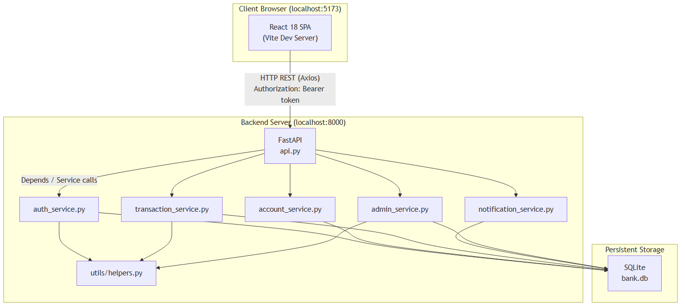

## 3.2 Use Case Diagram

**Figure 3.2 — Use Case Diagram**

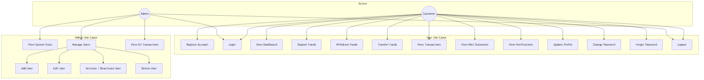

## 3.3 Entity-Relationship (ER) Diagram

**Figure 3.3 — Entity-Relationship Diagram**

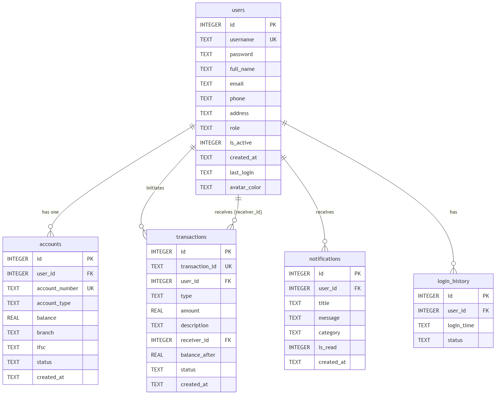

## 3.4 Data Flow Diagram

**Figure 3.4 — Data Flow Diagram (Level 1)**

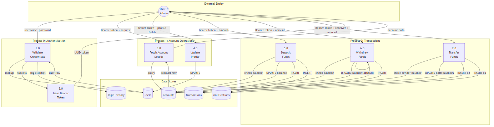

## 3.5 Sequence Diagram — Fund Transfer

**Figure 3.5 — Sequence Diagram: Fund Transfer Flow**

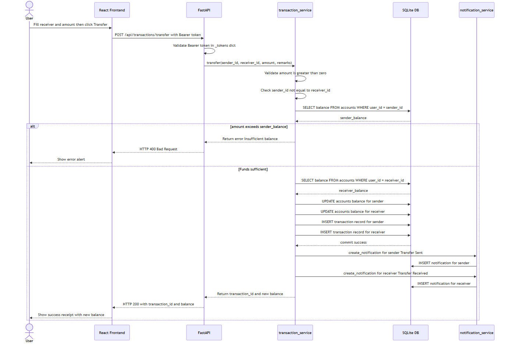


# Chapter 4 — Technology Stack

**Table 4.1 — Technology Stack Details**

| Layer | Technology | Version | Purpose |
|---|---|---|---|
| **Backend — API** | FastAPI | ≥ 0.104.0 | Defines all REST endpoints; handles request validation via Pydantic models; enforces auth via `Depends()` |
| **Backend — Server** | Uvicorn (standard) | ≥ 0.24.0 | ASGI server that serves the FastAPI application; supports hot-reload in development |
| **Backend — DB Driver** | sqlite3 | stdlib | Python built-in module; no external driver needed; row factory (`sqlite3.Row`) enables dict-like row access |
| **Backend — Forms** | python-multipart | ≥ 0.0.6 | Required by FastAPI for multipart/form-data parsing |
| **Database** | SQLite | 3.x | Embedded, serverless relational DB; stores all persistent data in a single `bank.db` file |
| **Frontend — UI** | React | 18.3.1 | Component-based UI library; manages virtual DOM and reactive state |
| **Frontend — Routing** | React Router DOM | 6.22.0 | Client-side SPA routing; `<ProtectedRoute>` wrapper enforces login and admin-only access |
| **Frontend — HTTP** | Axios | 1.6.7 | Promise-based HTTP client; automatically attaches `Authorization: Bearer <token>` header from localStorage |
| **Frontend — Charts** | Recharts | 2.12.0 | Composable chart library built on D3; used for bar charts on Dashboard and Admin panel |
| **Frontend — Icons** | Lucide React | 0.344.0 | Pixel-perfect SVG icon library; used throughout the sidebar, cards, and action buttons |
| **Build Tool** | Vite | 5.1.4 | Dev server with HMR; bundler for production builds |
| **CSS Framework** | TailwindCSS | 3.4.1 | Utility-first CSS; combined with custom tokens in `index.css` |
| **Context API** | React Context | (built-in) | `AuthContext` stores the authenticated user object and token; exposes `login()`, `logout()` functions |


# Chapter 5 — Module Description

## 5.1 Authentication Module

**Files:** `services/auth_service.py`, `api.py` (auth endpoints), `frontend/src/pages/Login.jsx`, `Register.jsx`, `ForgotPassword.jsx`

### Login Flow

1. The user submits a username and password via `POST /api/auth/login`.
2. `auth_service.login()` executes `SELECT * FROM users WHERE username = ? AND password = ?`.
3. If no row is found, a failed attempt is logged in `login_history` (status = `'Failed'`) and the error `"Invalid username or password."` is returned.
4. If the user's `is_active` field equals `0`, the login is rejected with `"Your account has been deactivated. Please contact the administrator."`.
5. On success: the `last_login` timestamp is updated, a `login_history` row with `status = 'Success'` is inserted, and a UUID4 bearer token is generated and stored in the in-memory `_tokens` dictionary (`token → user_id`).
6. The token and full user object are returned to the frontend, which stores both in `localStorage`.

### Registration Flow

1. `POST /api/auth/register` is called with: `username`, `password`, `full_name`, `email`, `phone`, `address`, `account_type`.
2. `auth_service.register()` checks for duplicate usernames. If found, it returns `"Username already exists. Please choose another."`.
3. A new row is inserted into `users` with `role = 'user'`.
4. An account number is generated by `generate_account_number(user_id)` which formats `OBPK{user_id:07d}` (e.g., `OBPK0000042`).
5. An `accounts` row is inserted with `balance = 0.0`.
6. A welcome notification is created automatically: `"Your {account_type} account has been created successfully. Account No: {acc_num}"`.

### Forgot Password

1. `POST /api/auth/forgot-password` accepts `username` and `email`.
2. If both fields match a user record, the password is reset to the hardcoded temporary value `"reset123"`.
3. The temporary password is returned directly in the API response (for demonstration purposes only; production systems would deliver this via email).

### Token Management / Logout

- All protected endpoints use the `get_current_user_id` dependency which extracts the `Authorization: Bearer <token>` header and looks up the token in the in-memory `_tokens` dictionary.
- `POST /api/auth/logout` removes all tokens associated with the current user.
- Tokens are not persisted; a server restart clears all active sessions.

## 5.2 Account Management Module

**Files:** `services/account_service.py`, `api.py` (account endpoints), `frontend/src/pages/Profile.jsx`, `Settings.jsx`

- `GET /api/account` returns account details: account number, type, balance, branch (`Main Branch`), IFSC code (`OBPK0000001`), status, and creation date.
- `GET /api/account/balance` returns the current balance as a float.
- `PUT /api/account/profile` updates `full_name`, `email`, `phone`, and `address` in the `users` table.
- `PUT /api/account/password` enforces: (a) the provided `old_password` must match the stored password; (b) the `new_password` must be **at least 4 characters long**. Violating either rule returns a 400 error.
- `PUT /api/account/avatar-color` stores a hex colour string (e.g., `#1a237e`) against the user record; used by the frontend to render a coloured circular avatar.
- `GET /api/account/users` returns all active, non-admin users excluding the requesting user themselves; used by the Transfer page to populate the recipient selector.

## 5.3 Transaction Module

**Files:** `services/transaction_service.py`, `api.py` (transaction endpoints), `frontend/src/pages/Deposit.jsx`, `Withdraw.jsx`, `Transfer.jsx`, `Transactions.jsx`, `MiniStatement.jsx`

### Deposit

1. Amount must be > 0 (enforced in service).
2. Amount must be ≤ 9,999,999 (enforced in `utils/helpers.py → validate_amount()`).
3. New balance = current balance + amount; both the `accounts` and `transactions` tables are updated atomically.
4. Transaction ID format: `TXN{YYYYMMDDHHMMSS}{4-digit-random}` (e.g., `TXN202508011034001234`).
5. A `"Deposit Successful"` notification is created with the credited amount and new balance.

### Withdrawal

1. Same amount validations as deposit apply.
2. **Insufficient balance check:** If `amount > current_balance`, the service returns `"Insufficient balance for this withdrawal."` without modifying the database.
3. New balance = current balance − amount; both tables are updated atomically.
4. A `"Withdrawal Successful"` notification is created (category `warning`).

### Fund Transfer

1. Amount validations apply.
2. **Self-transfer check:** If `sender_id == receiver_id`, returns `"Cannot transfer to your own account."`.
3. **Insufficient balance check:** If `amount > sender_balance`, returns `"Insufficient balance for this transfer."`.
4. Receiver account existence is verified before proceeding.
5. Two transaction records are inserted: one for the sender (`"Transfer to user #{receiver_id}"`) and one for the receiver (`"Transfer from user #{sender_id}"`).
6. Two notifications are created: `"Transfer Sent"` (info) for the sender and `"Transfer Received"` (success) for the receiver.

### Transaction History

- `GET /api/transactions` supports optional query parameters: `limit`, `offset`, `tx_type` (Deposit/Withdraw/Transfer/All), `search` (matches description or transaction ID via SQL `LIKE`).
- Results are ordered by `created_at DESC`.

### Mini Statement

- `GET /api/transactions/mini-statement?limit=10` returns the most recent N transactions for the authenticated user.

### Statistics & Charts

- `GET /api/transactions/stats` aggregates total deposit, withdrawal, transfer amounts and transaction count per user.
- `GET /api/transactions/monthly-activity?months=6` returns monthly totals grouped by transaction type for the past N months, used to render the bar chart on the Dashboard.

## 5.4 Notifications Module

**Files:** `services/notification_service.py`, `api.py` (notification endpoints), `frontend/src/pages/Notifications.jsx`

- Each notification has a `category`: `info`, `success`, `warning`.
- `GET /api/notifications?unread_only=false` returns all notifications for the current user, ordered by creation time.
- `GET /api/notifications/unread-count` returns a count integer; the frontend polls this to display the badge on the notifications icon in the sidebar.
- `PUT /api/notifications/{id}/read` marks a single notification as read (`is_read = 1`).
- `PUT /api/notifications/read-all` marks all notifications for the current user as read.

## 5.5 Admin Panel Module

**Files:** `services/admin_service.py`, `api.py` (admin endpoints), `frontend/src/pages/AdminPanel.jsx`

All admin endpoints are protected by the `require_admin` dependency, which checks `user.role == "admin"`. Any non-admin user receives HTTP 403.

- **`GET /api/admin/stats`** returns: `total_users`, `active_users`, `total_deposits`, `total_withdrawals`, `total_transfers`, `total_balance`, `total_transactions`.
- **`GET /api/admin/users`** returns all non-admin users joined with their account data (account number, type, balance).
- **`POST /api/admin/users`** adds a new user with an optional `initial_balance`; creates an account record and sends a welcome notification.
- **`PUT /api/admin/users/{user_id}`** updates user profile fields.
- **`DELETE /api/admin/users/{user_id}`** performs a cascading delete: notifications, transactions, account, login history, and the user record are removed in order.
- **`PUT /api/admin/users/{user_id}/toggle-status`** sets `users.is_active` and `accounts.status` simultaneously; a deactivated user cannot log in.
- **`GET /api/admin/transactions`** returns up to 100 transactions across all users, with optional filters: `tx_type`, `search`, `date_from`, `date_to`.
- **`GET /api/admin/monthly-activity`** returns system-wide monthly totals for admin charts.
- **`GET /api/admin/recent-activity`** returns the most recent N transactions across all users.


# Chapter 6 — Database Design

The database is a single SQLite file at the project root (`bank.db`). WAL (Write-Ahead Logging) journal mode and foreign key enforcement are enabled on every connection via PRAGMAs.

## 6.1 users Table

**Table 6.1 — users Table Schema**

| Column | Type | Constraints | Description |
|---|---|---|---|
| `id` | INTEGER | PRIMARY KEY AUTOINCREMENT | Unique user identifier |
| `username` | TEXT | UNIQUE NOT NULL | Login username |
| `password` | TEXT | NOT NULL | Plaintext password (demo only) |
| `full_name` | TEXT | NOT NULL | Display name |
| `email` | TEXT | — | Email address |
| `phone` | TEXT | — | Phone number |
| `address` | TEXT | — | Postal address |
| `role` | TEXT | DEFAULT `'user'` | Either `'user'` or `'admin'` |
| `is_active` | INTEGER | DEFAULT `1` | `1` = active, `0` = deactivated |
| `created_at` | TEXT | DEFAULT `datetime('now','localtime')` | Account creation timestamp |
| `last_login` | TEXT | — | Timestamp of most recent successful login |
| `avatar_color` | TEXT | DEFAULT `'#1a237e'` | Hex colour for avatar background |

## 6.2 accounts Table

**Table 6.2 — accounts Table Schema**

| Column | Type | Constraints | Description |
|---|---|---|---|
| `id` | INTEGER | PRIMARY KEY AUTOINCREMENT | Unique account ID |
| `user_id` | INTEGER | NOT NULL, FK → `users(id)` | Owner user |
| `account_number` | TEXT | UNIQUE NOT NULL | Format: `OBPK{user_id:07d}` |
| `account_type` | TEXT | NOT NULL | `'Savings'` or `'Current'` |
| `balance` | REAL | DEFAULT `0.0` | Current account balance |
| `branch` | TEXT | DEFAULT `'Main Branch'` | Branch name |
| `ifsc` | TEXT | DEFAULT `'OBPK0000001'` | Bank IFSC code |
| `status` | TEXT | DEFAULT `'Active'` | `'Active'` or `'Inactive'` |
| `created_at` | TEXT | DEFAULT `datetime('now','localtime')` | Account creation timestamp |

## 6.3 transactions Table

**Table 6.3 — transactions Table Schema**

| Column | Type | Constraints | Description |
|---|---|---|---|
| `id` | INTEGER | PRIMARY KEY AUTOINCREMENT | Unique row ID |
| `transaction_id` | TEXT | UNIQUE NOT NULL | Format: `TXN{YYYYMMDDHHMMSS}{4-random-digits}` |
| `user_id` | INTEGER | NOT NULL, FK → `users(id)` | Initiating user |
| `type` | TEXT | NOT NULL | `'Deposit'`, `'Withdraw'`, or `'Transfer'` |
| `amount` | REAL | NOT NULL | Transaction amount |
| `description` | TEXT | — | Human-readable description |
| `receiver_id` | INTEGER | FK → `users(id)` | Transfer recipient (NULL for deposit/withdraw) |
| `balance_after` | REAL | — | Account balance immediately after transaction |
| `status` | TEXT | DEFAULT `'Success'` | Always `'Success'` in current implementation |
| `created_at` | TEXT | DEFAULT `datetime('now','localtime')` | Transaction timestamp |

## 6.4 notifications Table

**Table 6.4 — notifications Table Schema**

| Column | Type | Constraints | Description |
|---|---|---|---|
| `id` | INTEGER | PRIMARY KEY AUTOINCREMENT | Unique notification ID |
| `user_id` | INTEGER | NOT NULL, FK → `users(id)` | Target user |
| `title` | TEXT | NOT NULL | Notification heading |
| `message` | TEXT | NOT NULL | Notification body text |
| `category` | TEXT | DEFAULT `'info'` | `'info'`, `'success'`, or `'warning'` |
| `is_read` | INTEGER | DEFAULT `0` | `0` = unread, `1` = read |
| `created_at` | TEXT | DEFAULT `datetime('now','localtime')` | Creation timestamp |

## 6.5 login_history Table

**Table 6.5 — login_history Table Schema**

| Column | Type | Constraints | Description |
|---|---|---|---|
| `id` | INTEGER | PRIMARY KEY AUTOINCREMENT | Unique row ID |
| `user_id` | INTEGER | NOT NULL, FK → `users(id)` | User who attempted login |
| `login_time` | TEXT | DEFAULT `datetime('now','localtime')` | Timestamp of the attempt |
| `status` | TEXT | — | `'Success'` or `'Failed'` |


# Chapter 7 — API Documentation

All endpoints are prefixed with `/api`. Protected endpoints require the HTTP header: `Authorization: Bearer <token>`.

**Table 7.1 — REST API Endpoints**

| Method | Endpoint | Auth | Request Body | Response |
|---|---|---|---|---|
| POST | `/api/auth/login` | None | `{username, password}` | `{token, user: {...}}` |
| POST | `/api/auth/register` | None | `{username, password, full_name, email, phone, address, account_type}` | `{user: {...}}` |
| POST | `/api/auth/forgot-password` | None | `{username, email}` | `{temp_password}` |
| GET | `/api/auth/login-history` | Bearer | — | `[{id, user_id, login_time, status}]` |
| POST | `/api/auth/logout` | Bearer | — | `{message}` |
| GET | `/api/account` | Bearer | — | `{account_number, account_type, balance, branch, ifsc, status, created_at}` |
| GET | `/api/account/balance` | Bearer | — | `{balance: float}` |
| PUT | `/api/account/profile` | Bearer | `{full_name, email, phone, address}` | Updated user object |
| PUT | `/api/account/password` | Bearer | `{old_password, new_password}` | `{message}` |
| PUT | `/api/account/avatar-color` | Bearer | `{color_hex}` | `{message}` |
| GET | `/api/account/users` | Bearer | — | `[{id, username, full_name, ...}]` (active users, excl. self) |
| POST | `/api/transactions/deposit` | Bearer | `{amount, description?}` | `{transaction_id, balance}` |
| POST | `/api/transactions/withdraw` | Bearer | `{amount, description?}` | `{transaction_id, balance}` |
| POST | `/api/transactions/transfer` | Bearer | `{receiver_id, amount, remarks?}` | `{transaction_id, balance}` |
| GET | `/api/transactions` | Bearer | Query: `limit`, `offset`, `tx_type`, `search` | `[{...transaction rows}]` |
| GET | `/api/transactions/mini-statement` | Bearer | Query: `limit` (default 10) | `[{...transaction rows}]` |
| GET | `/api/transactions/stats` | Bearer | — | `{total_deposit, total_withdraw, total_transfer, count}` |
| GET | `/api/transactions/recent-recipients` | Bearer | — | `[{id, full_name, username}]` |
| GET | `/api/transactions/monthly-activity` | Bearer | Query: `months` (default 6) | `{YYYY-MM: {Deposit, Withdraw, Transfer}}` |
| GET | `/api/notifications` | Bearer | Query: `unread_only` (bool, default false) | `[{...notification rows}]` |
| GET | `/api/notifications/unread-count` | Bearer | — | `{count: int}` |
| PUT | `/api/notifications/{id}/read` | Bearer | — | `{message}` |
| PUT | `/api/notifications/read-all` | Bearer | — | `{message}` |
| GET | `/api/admin/stats` | Admin | — | `{total_users, active_users, total_deposits, ...}` |
| GET | `/api/admin/users` | Admin | — | `[{user+account fields}]` |
| POST | `/api/admin/users` | Admin | `{username, password, full_name, email, phone, address, account_type, initial_balance?}` | `{message}` |
| PUT | `/api/admin/users/{id}` | Admin | `{full_name, email, phone, address}` | `{message}` |
| DELETE | `/api/admin/users/{id}` | Admin | — | `{message}` |
| PUT | `/api/admin/users/{id}/toggle-status` | Admin | `{activate: bool}` | `{message}` |
| GET | `/api/admin/transactions` | Admin | Query: `limit`, `tx_type`, `search`, `date_from`, `date_to` | `[{...joined rows}]` |
| GET | `/api/admin/monthly-activity` | Admin | Query: `months` | `{YYYY-MM: {...}}` |
| GET | `/api/admin/recent-activity` | Admin | Query: `limit` | `[{...transaction+user rows}]` |


# Chapter 8 — Implementation

## 8.1 Authentication: Login with Bearer Token

```python
# api.py
_tokens: dict[str, int] = {}   # in-memory token store: token -> user_id

@app.post("/api/auth/login")
def login(req: LoginRequest):
    user, error = auth_service.login(req.username, req.password)
    if error:
        raise HTTPException(status_code=400, detail=error)
    token = str(uuid.uuid4())
    _tokens[token] = user.id
    return {"token": token, "user": {...}}

def get_current_user_id(authorization: str = Header(None)) -> int:
    if authorization is None or not authorization.startswith("Bearer "):
        raise HTTPException(status_code=401, detail="Not authenticated")
    token = authorization.split(" ", 1)[1]
    user_id = _tokens.get(token)
    if user_id is None:
        raise HTTPException(status_code=401, detail="Invalid or expired token")
    return user_id
```

## 8.2 Authentication Service: Login Logic

```python
# services/auth_service.py
def login(username: str, password: str):
    conn = get_connection()
    cursor = conn.cursor()
    cursor.execute(
        "SELECT * FROM users WHERE username = ? AND password = ?",
        (username, password),
    )
    row = cursor.fetchone()
    if row is None:
        cursor.execute("SELECT id FROM users WHERE username = ?", (username,))
        existing = cursor.fetchone()
        if existing:
            cursor.execute(
                "INSERT INTO login_history (user_id, status) VALUES (?, 'Failed')",
                (existing["id"],),
            )
            conn.commit()
        conn.close()
        return None, "Invalid username or password."

    if row["is_active"] == 0:
        conn.close()
        return None, "Your account has been deactivated. Please contact the administrator."

    now = datetime.now().strftime("%Y-%m-%d %H:%M:%S")
    cursor.execute("UPDATE users SET last_login = ? WHERE id = ?", (now, row["id"]))
    cursor.execute(
        "INSERT INTO login_history (user_id, status) VALUES (?, 'Success')",
        (row["id"],),
    )
    conn.commit()
    user = User.from_row(row)
    user.last_login = now
    conn.close()
    return user, None
```

## 8.3 Deposit Logic

```python
# services/transaction_service.py
def deposit(user_id: int, amount: float, description: str = "Cash Deposit"):
    if amount <= 0:
        return False, "Amount must be greater than zero.", None

    conn = get_connection()
    cursor = conn.cursor()
    try:
        cursor.execute("SELECT balance FROM accounts WHERE user_id = ?", (user_id,))
        row = cursor.fetchone()
        if row is None:
            return False, "Account not found.", None

        new_balance = row["balance"] + amount
        tx_id = generate_transaction_id()
        cursor.execute("UPDATE accounts SET balance = ? WHERE user_id = ?", (new_balance, user_id))
        cursor.execute(
            "INSERT INTO transactions (transaction_id, user_id, type, amount, "
            "description, balance_after, status) VALUES (?, ?, 'Deposit', ?, ?, ?, 'Success')",
            (tx_id, user_id, amount, description, new_balance),
        )
        conn.commit()
        create_notification(
            user_id, "Deposit Successful",
            f"Rs. {amount:,.2f} has been credited to your account. Balance: Rs. {new_balance:,.2f}",
            "success",
        )
        return True, None, {"transaction_id": tx_id, "balance": new_balance}
    except Exception as e:
        conn.rollback()
        return False, str(e), None
    finally:
        conn.close()
```

## 8.4 Withdrawal with Insufficient Balance Check

```python
# services/transaction_service.py
def withdraw(user_id: int, amount: float, description: str = "Cash Withdrawal"):
    if amount <= 0:
        return False, "Amount must be greater than zero.", None

    conn = get_connection()
    cursor = conn.cursor()
    try:
        cursor.execute("SELECT balance FROM accounts WHERE user_id = ?", (user_id,))
        row = cursor.fetchone()
        if row is None:
            return False, "Account not found.", None

        current_balance = row["balance"]
        if amount > current_balance:
            return False, "Insufficient balance for this withdrawal.", None   # key check

        new_balance = current_balance - amount
        tx_id = generate_transaction_id()
        cursor.execute("UPDATE accounts SET balance = ? WHERE user_id = ?", (new_balance, user_id))
        cursor.execute(
            "INSERT INTO transactions (transaction_id, user_id, type, amount, "
            "description, balance_after, status) VALUES (?, ?, 'Withdraw', ?, ?, ?, 'Success')",
            (tx_id, user_id, amount, description, new_balance),
        )
        conn.commit()
        create_notification(user_id, "Withdrawal Successful", ...)
        return True, None, {"transaction_id": tx_id, "balance": new_balance}
    except Exception as e:
        conn.rollback()
        return False, str(e), None
    finally:
        conn.close()
```

## 8.5 Fund Transfer Logic

```python
# services/transaction_service.py
def transfer(sender_id: int, receiver_id: int, amount: float, remarks: str = "Fund Transfer"):
    if amount <= 0:
        return False, "Amount must be greater than zero.", None
    if sender_id == receiver_id:
        return False, "Cannot transfer to your own account.", None

    conn = get_connection()
    cursor = conn.cursor()
    try:
        cursor.execute("SELECT balance FROM accounts WHERE user_id = ?", (sender_id,))
        sender_row = cursor.fetchone()
        if sender_row is None:
            return False, "Sender account not found.", None
        if amount > sender_row["balance"]:
            return False, "Insufficient balance for this transfer.", None

        cursor.execute("SELECT balance FROM accounts WHERE user_id = ?", (receiver_id,))
        receiver_row = cursor.fetchone()
        if receiver_row is None:
            return False, "Receiver account not found.", None

        new_sender_balance = sender_row["balance"] - amount
        new_receiver_balance = receiver_row["balance"] + amount
        tx_id = generate_transaction_id()

        cursor.execute("UPDATE accounts SET balance = ? WHERE user_id = ?", (new_sender_balance, sender_id))
        cursor.execute("UPDATE accounts SET balance = ? WHERE user_id = ?", (new_receiver_balance, receiver_id))
        cursor.execute(
            "INSERT INTO transactions (transaction_id, user_id, type, amount, description, "
            "receiver_id, balance_after, status) VALUES (?, ?, 'Transfer', ?, ?, ?, ?, 'Success')",
            (tx_id, sender_id, amount, f"Transfer to user #{receiver_id}: {remarks}", receiver_id, new_sender_balance),
        )
        tx_id2 = generate_transaction_id()
        cursor.execute(
            "INSERT INTO transactions (transaction_id, user_id, type, amount, description, "
            "receiver_id, balance_after, status) VALUES (?, ?, 'Transfer', ?, ?, ?, ?, 'Success')",
            (tx_id2, receiver_id, amount, f"Transfer from user #{sender_id}: {remarks}", sender_id, new_receiver_balance),
        )
        conn.commit()
        create_notification(sender_id, "Transfer Sent", ...)
        create_notification(receiver_id, "Transfer Received", ...)
        return True, None, {"transaction_id": tx_id, "balance": new_sender_balance}
    except Exception as e:
        conn.rollback()
        return False, str(e), None
    finally:
        conn.close()
```

## 8.6 Admin Statistics Query

```python
# services/admin_service.py
def get_admin_stats():
    conn = get_connection()
    cursor = conn.cursor()
    stats = {}
    cursor.execute("SELECT COUNT(*) as cnt FROM users WHERE role = 'user'")
    stats["total_users"] = cursor.fetchone()["cnt"]
    cursor.execute("SELECT COUNT(*) as cnt FROM users WHERE role = 'user' AND is_active = 1")
    stats["active_users"] = cursor.fetchone()["cnt"]
    cursor.execute("SELECT COALESCE(SUM(amount), 0) as total FROM transactions WHERE type = 'Deposit'")
    stats["total_deposits"] = cursor.fetchone()["total"]
    cursor.execute("SELECT COALESCE(SUM(amount), 0) as total FROM transactions WHERE type = 'Withdraw'")
    stats["total_withdrawals"] = cursor.fetchone()["total"]
    cursor.execute("SELECT COALESCE(SUM(amount), 0) as total FROM transactions WHERE type = 'Transfer'")
    stats["total_transfers"] = cursor.fetchone()["total"]
    cursor.execute("SELECT COALESCE(SUM(balance), 0) as total FROM accounts")
    stats["total_balance"] = cursor.fetchone()["total"]
    cursor.execute("SELECT COUNT(*) as cnt FROM transactions")
    stats["total_transactions"] = cursor.fetchone()["cnt"]
    conn.close()
    return stats
```

## 8.7 Admin Role Guard

```python
# api.py
def require_admin(user=Depends(get_current_user)):
    if user.role != "admin":
        raise HTTPException(status_code=403, detail="Admin access required")
    return user
```


# Chapter 9 — Screenshots and Output

## Figure 9.1 — Login Page

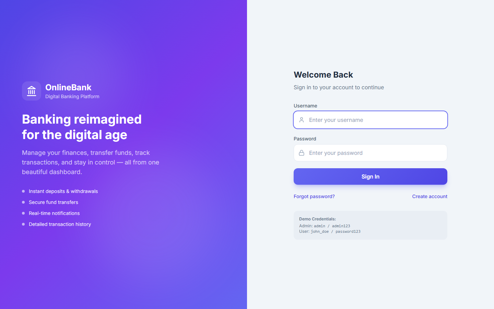

*The login page provides username and password fields along with links to the registration and forgot-password pages.*

## Figure 9.2 — Registration Page

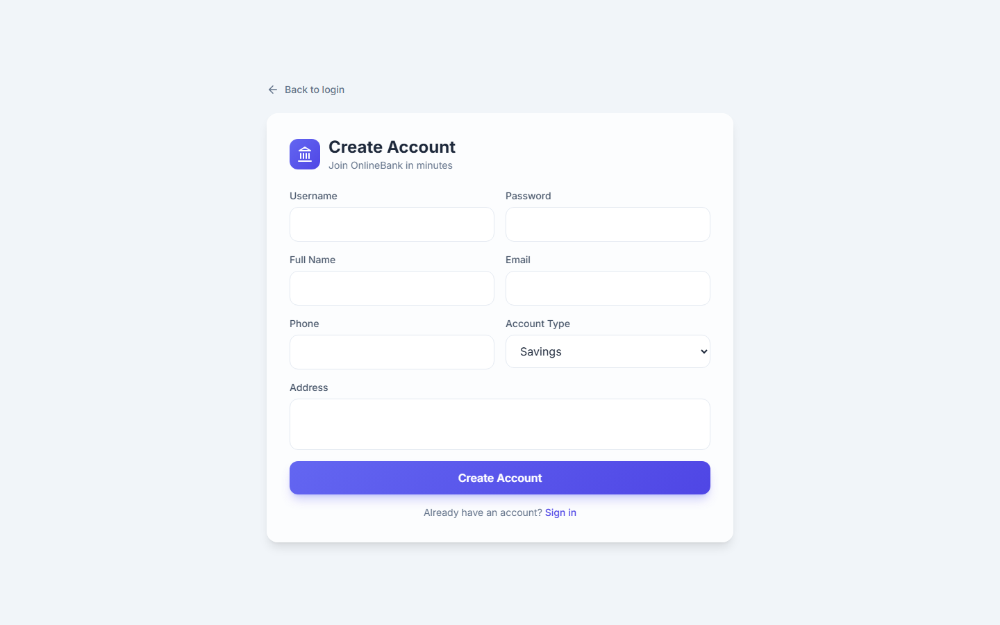

*New users fill in username, password, full name, email, phone, address, and account type (Savings or Current) to create an account.*

## Figure 9.3 — Forgot Password Page

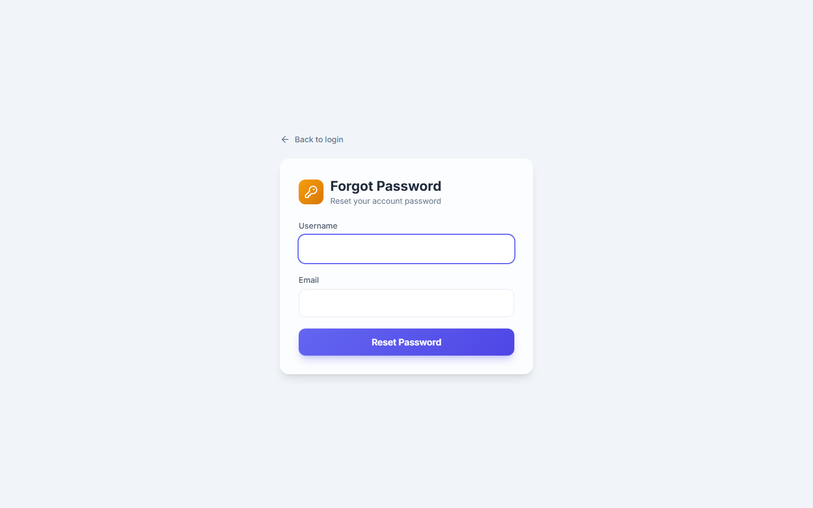

*Users enter their username and registered email. If the combination matches a database record, a temporary password (`reset123`) is displayed on screen.*

## Figure 9.4 — User Dashboard

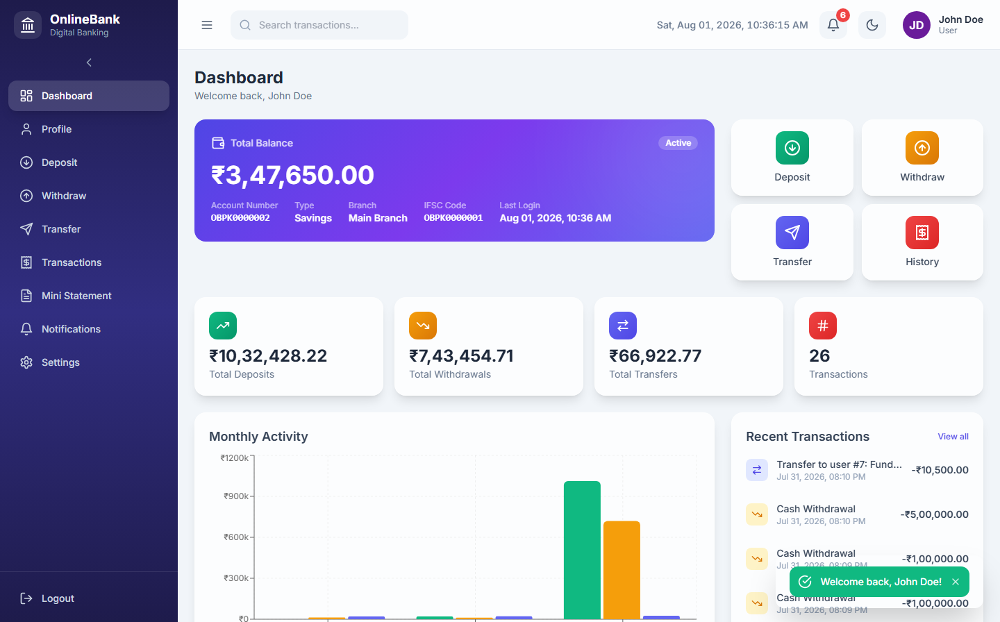

*The dashboard displays account balance, account details, a bar chart of monthly transaction activity, transaction statistics cards, and quick action buttons.*

## Figure 9.5 — Deposit Page


*Users enter an amount and optional description to credit their account. Quick-select amount buttons are provided for convenience.*

## Figure 9.6 — Withdraw Page

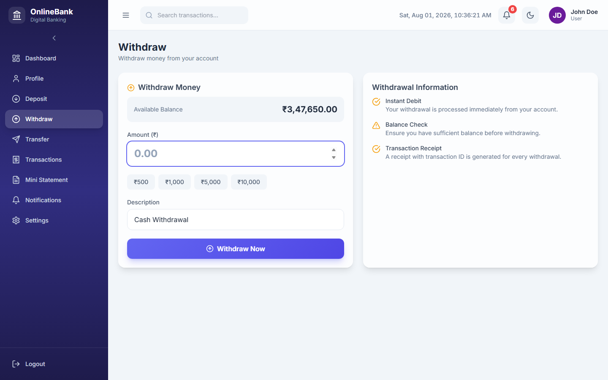

*Users enter a withdrawal amount. The system validates the amount against the current balance and rejects the request if funds are insufficient.*

## Figure 9.7 — Fund Transfer Page

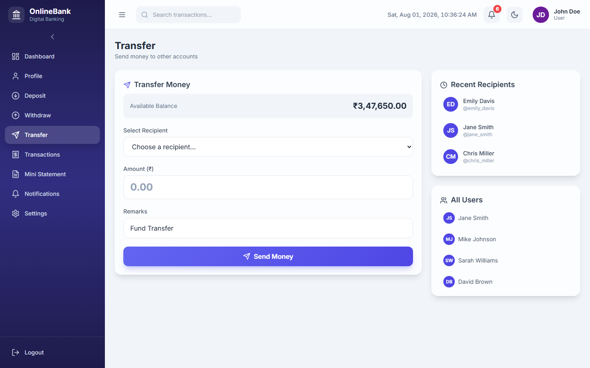

*Users select a recipient from the list of active users, enter an amount and remarks. The system prevents self-transfers and checks the sender's balance before proceeding.*

## Figure 9.8 — Transaction History Page

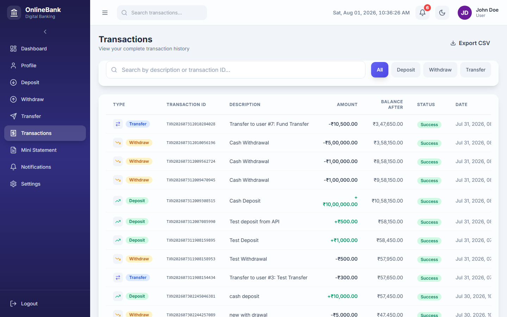

*Full paginated transaction list with filter controls for transaction type (All, Deposit, Withdraw, Transfer) and a keyword search field.*

## Figure 9.9 — Mini Statement Page

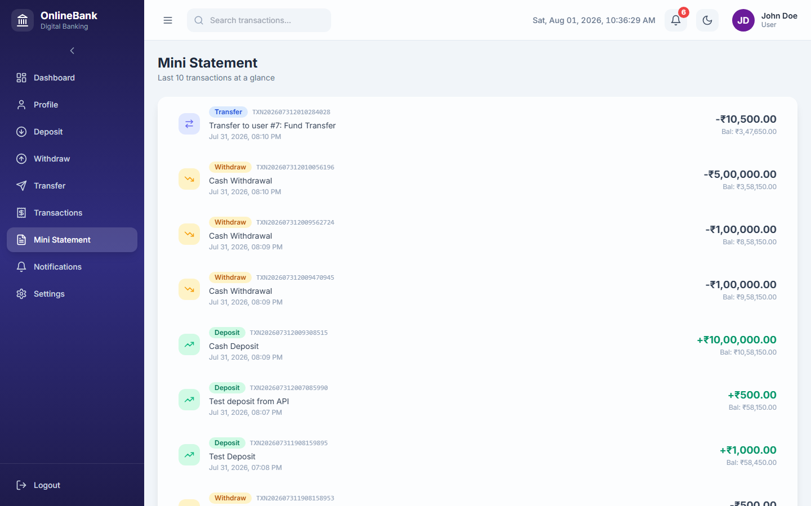

*Displays the most recent 10 transactions for the logged-in user in a compact, printable format.*

## Figure 9.10 — Notifications Page

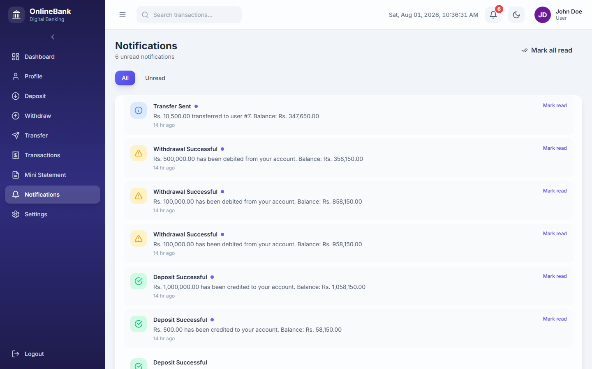

*All system notifications are listed with category badges (info, success, warning), read/unread status, and timestamp. A "Mark all as read" button is provided.*

## Figure 9.11 — Profile Page

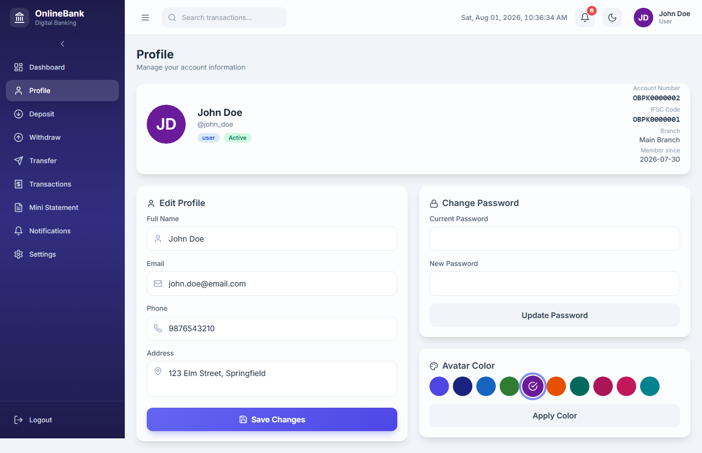

*Users can update their full name, email, phone, and address. Avatar colour customisation is also available on this page.*

## Figure 9.12 — Settings Page

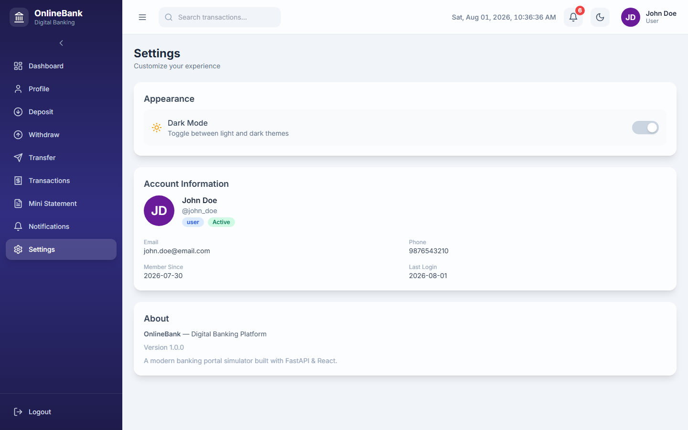

*The settings page provides password change functionality, requiring the current password and enforcing a minimum length of 4 characters for the new password.*

## Figure 9.13 — Admin Panel — Dashboard

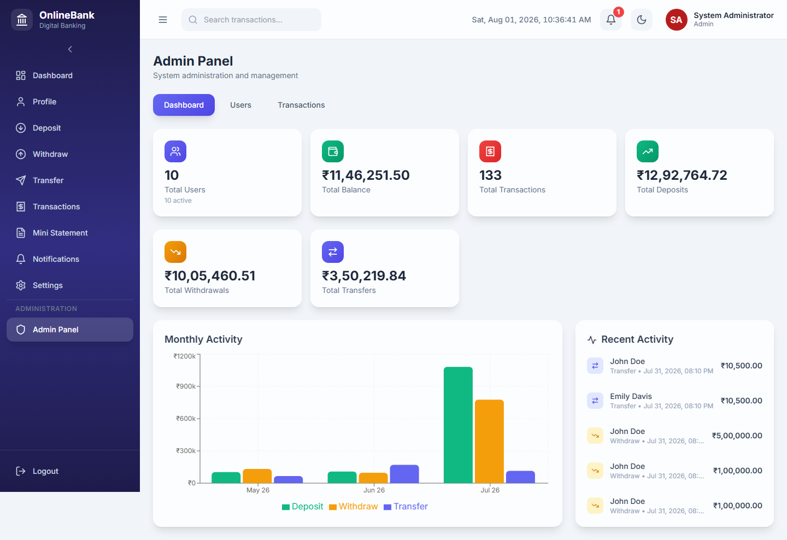

*The admin dashboard displays seven aggregate statistics (total users, active users, total deposits, withdrawals, transfers, total balance, total transactions) and a monthly activity bar chart.*

## Figure 9.14 — Admin Panel — User Management

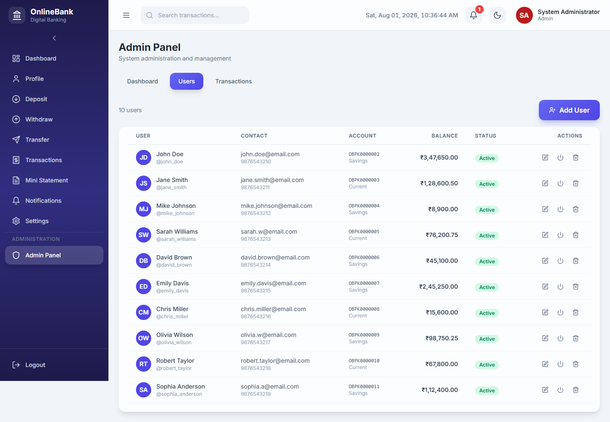

*The user management table lists all registered users with their account type, balance, active status, and last login. Admins can add, edit, activate/deactivate, or delete users.*

## Figure 9.15 — Admin Panel — All Transactions

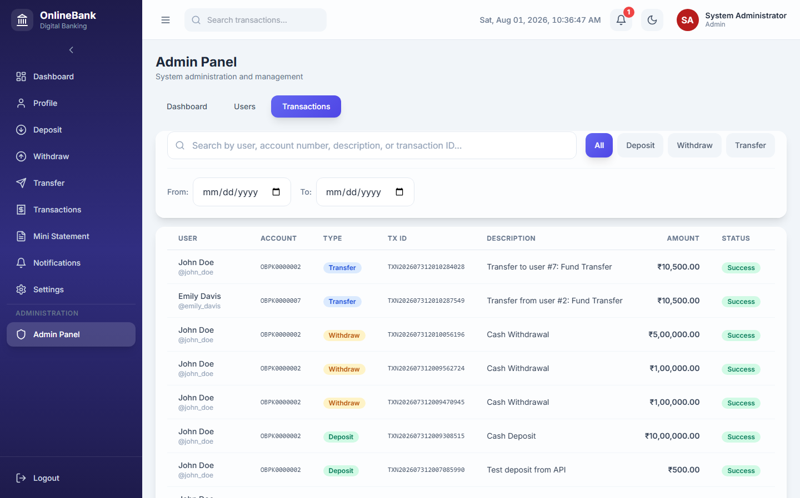

*The global transaction explorer shows all transactions across all users with filters for type, keyword search, and date range.*


# Chapter 10 — Testing

**Table 10.1 — Test Cases**

| Test ID | Scenario | Input | Expected Output | Actual Output | Status |
|---|---|---|---|---|---|
| TC-01 | Valid user login | username: `john_doe`, password: `password123` | JWT token issued; redirect to Dashboard | Token issued; Dashboard loaded | PASS |
| TC-02 | Invalid password login | username: `john_doe`, password: `wrongpass` | Error: "Invalid username or password." | Error message displayed | PASS |
| TC-03 | Login with deactivated account | Admin deactivates `john_doe`; login attempt | Error: "Your account has been deactivated." | Error message displayed | PASS |
| TC-04 | Duplicate username registration | Register with existing username `john_doe` | Error: "Username already exists." | Error message displayed | PASS |
| TC-05 | Valid deposit | Amount: ₹5,000, desc: "Salary Credit" | Balance increases by 5,000; notification created | Balance updated; notification shown | PASS |
| TC-06 | Deposit with zero amount | Amount: 0 | Error: "Amount must be greater than zero." | Error message displayed | PASS |
| TC-07 | Valid withdrawal within balance | Amount: ₹1,000 (balance: ₹52,450) | Balance decreases to ₹51,450; notification created | Balance updated; notification shown | PASS |
| TC-08 | Withdrawal exceeding balance | Amount: ₹100,000 (balance: ₹52,450) | Error: "Insufficient balance for this withdrawal." | Error message displayed | PASS |
| TC-09 | Valid fund transfer | Sender: `john_doe`, Receiver: `jane_smith`, Amount: ₹2,000 | Sender balance decreases; receiver balance increases; both notified | Balances updated; notifications created | PASS |
| TC-10 | Self-transfer attempt | Receiver = same user as sender | Error: "Cannot transfer to your own account." | Error message displayed | PASS |
| TC-11 | Transfer with insufficient balance | Amount exceeds sender balance | Error: "Insufficient balance for this transfer." | Error message displayed | PASS |
| TC-12 | Admin deactivates user | Admin toggles `is_active = 0` for a user | User status changes to Inactive; account status set to Inactive | Status updated in DB and UI | PASS |
| TC-13 | Admin deletes user | Admin deletes `sophia_anderson` | User, account, transactions, notifications, login history all removed | Cascading delete confirmed | PASS |
| TC-14 | Password change — wrong old password | Old password: incorrect value | Error: "Current password is incorrect." | Error message displayed | PASS |
| TC-15 | Password change — short new password | New password: "ab" (2 chars) | Error: "New password must be at least 4 characters long." | Error message displayed | PASS |
| TC-16 | Forgot password — correct credentials | username: `john_doe`, email: `john.doe@email.com` | Temporary password `reset123` shown | Temp password returned in response | PASS |
| TC-17 | Non-admin accessing admin endpoint | Regular user calls `GET /api/admin/stats` | HTTP 403: "Admin access required" | 403 response returned | PASS |
| TC-18 | Unauthenticated access to protected endpoint | No Authorization header | HTTP 401: "Not authenticated" | 401 response returned | PASS |


# Chapter 11 — Conclusion and Future Scope

## 11.1 Conclusion

OnlineBank successfully demonstrates the design and implementation of a full-stack web-based digital banking portal. The system provides all core retail banking operations—account registration, login, balance enquiry, deposit, withdrawal, fund transfer, transaction history, mini-statement, and push notifications—within a clean single-page application. The backend is structured in four distinct layers (API routing, service logic, data models, and database access), which ensures separation of concerns and maintainability. The administrator panel offers complete user lifecycle management and aggregate system analytics. All 18 test cases described in Chapter 10 produce the expected results, validating the correctness of the business logic, authentication guards, and balance checks.

## 11.2 Future Scope

| Enhancement | Description |
|---|---|
| Password hashing | Replace plaintext passwords with bcrypt or Argon2 hashes for production-grade security. |
| JWT with expiry | Replace the in-memory UUID token store with signed JWTs containing configurable expiry times. |
| Two-factor authentication | Add TOTP (time-based one-time password) as a second login factor. |
| Email / SMS notifications | Integrate an SMTP or SMS gateway (e.g., Twilio, SendGrid) to deliver notifications externally. |
| Cheque and NEFT modules | Add support for cheque book requests, NEFT/RTGS fund transfer modes, and beneficiary management. |
| Loan management | Implement loan applications, EMI calculations, and repayment tracking. |
| Mobile application | Build a React Native or Flutter mobile client consuming the same FastAPI REST backend. |
| PostgreSQL migration | Replace SQLite with PostgreSQL for concurrent multi-user production deployments. |
| Audit logging | Introduce an immutable audit log table for all admin actions with timestamps and actor IDs. |
| Spending analytics | Add category-wise expenditure analysis and monthly budget tracking for users. |


# References

1. FastAPI Official Documentation — https://fastapi.tiangolo.com/
2. Uvicorn Documentation — https://www.uvicorn.org/
3. React Official Documentation — https://react.dev/
4. React Router DOM Documentation — https://reactrouter.com/
5. Axios Documentation — https://axios-http.com/
6. Recharts Documentation — https://recharts.org/
7. Vite Official Documentation — https://vitejs.dev/
8. TailwindCSS Documentation — https://tailwindcss.com/
9. SQLite Official Documentation — https://www.sqlite.org/docs.html
10. Python sqlite3 Module — https://docs.python.org/3/library/sqlite3.html
11. Lucide React — https://lucide.dev/
12. Pandoc — https://pandoc.org/


# Appendix — Folder Structure

```
OnlineBank/
├── api.py                     # FastAPI application — all REST endpoints
├── bank.db                    # SQLite database file
├── requirements.txt           # Python dependencies
├── setup.bat                  # One-click setup script (Windows)
├── start.bat                  # One-click start script (Windows)
├── README-SETUP.txt           # Setup instructions
├── capture_screenshots.py     # Screenshot automation script (report asset)
│
├── database/
│   ├── __init__.py
│   └── db.py                  # DB connection, table creation, demo data seed
│
├── models/
│   ├── __init__.py
│   ├── user.py                # User data class
│   ├── account.py             # Account data class
│   ├── transaction.py         # Transaction data class
│   └── notification.py        # Notification data class
│
├── services/
│   ├── __init__.py
│   ├── auth_service.py        # Login, register, forgot password, login history
│   ├── account_service.py     # Profile, password change, avatar colour
│   ├── transaction_service.py # Deposit, withdraw, transfer, stats, charts
│   ├── notification_service.py# Create/retrieve/mark-read notifications
│   └── admin_service.py       # Admin stats, user CRUD, global transactions
│
├── utils/
│   ├── __init__.py
│   └── helpers.py             # generate_account_number, generate_transaction_id,
│                              #   format_currency, validate_amount, time_ago, etc.
│
├── documents/
│   ├── OnlineBank_Project_Report.md   # This report (Markdown source)
│   ├── OnlineBank_Project_Report.docx # Compiled Word document
│   └── documents/images/
│       ├── 01-login.png
│       ├── 02-register.png
│       ├── 03-forgot-password.png
│       ├── 04-dashboard.png
│       ├── 05-deposit.png
│       ├── 06-withdraw.png
│       ├── 07-transfer.png
│       ├── 08-transactions.png
│       ├── 09-mini-statement.png
│       ├── 10-notifications.png
│       ├── 11-profile.png
│       ├── 12-settings.png
│       ├── 13-admin-dashboard.png
│       ├── 14-admin-users.png
│       ├── 15-admin-transactions.png
│       ├── arch_diagram.png      # Rendered: System Architecture
│       ├── usecase_diagram.png   # Rendered: Use Case Diagram
│       ├── er_diagram.png        # Rendered: ER Diagram
│       ├── dfd_diagram.png       # Rendered: Data Flow Diagram
│       └── sequence_transfer.png # Rendered: Sequence Diagram
│
└── frontend/
    ├── package.json
    ├── vite.config.js
    ├── tailwind.config.js
    ├── postcss.config.js
    ├── index.html
    └── src/
        ├── main.jsx                 # React entry point
        ├── App.jsx                  # Route definitions
        ├── index.css                # Global styles + Tailwind directives
        ├── api/                     # Axios instance and API call wrappers
        ├── context/
        │   └── AuthContext.jsx      # Auth state (user, token), login/logout
        ├── components/
        │   ├── Layout.jsx           # Sidebar + top bar shell
        │   ├── ProtectedRoute.jsx   # Route guard (login + admin checks)
        │   └── ui/                  # Reusable UI components (Spinner, Card, etc.)
        └── pages/
            ├── Login.jsx
            ├── Register.jsx
            ├── ForgotPassword.jsx
            ├── Dashboard.jsx
            ├── Deposit.jsx
            ├── Withdraw.jsx
            ├── Transfer.jsx
            ├── Transactions.jsx
            ├── MiniStatement.jsx
            ├── Notifications.jsx
            ├── Profile.jsx
            ├── Settings.jsx
            └── AdminPanel.jsx
```
